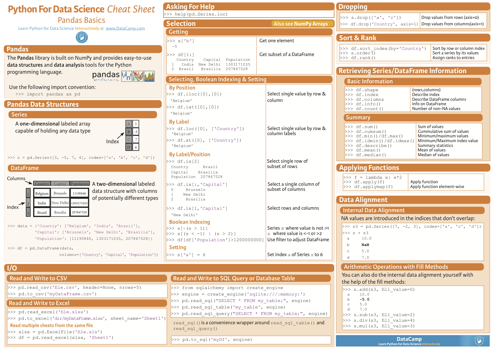
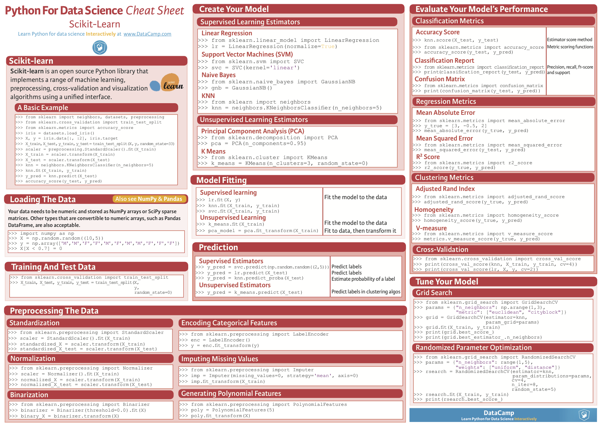
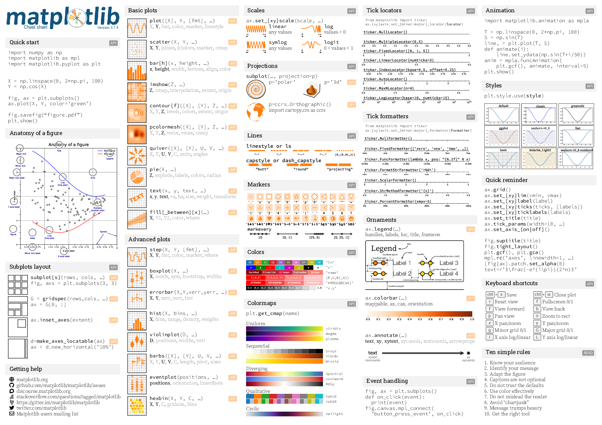
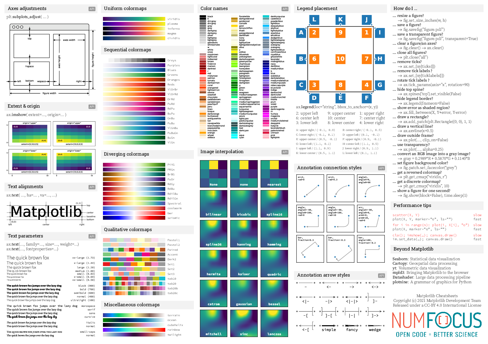
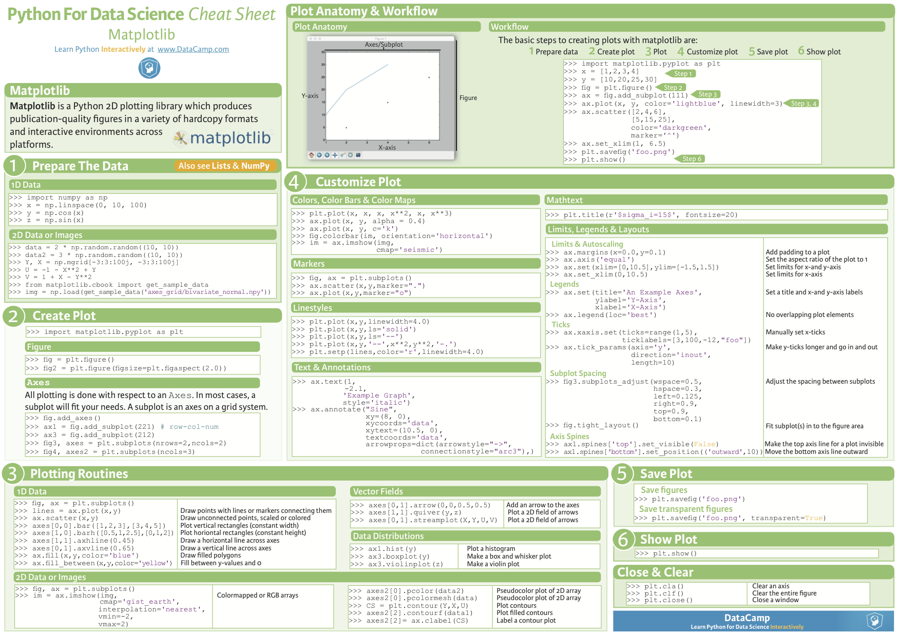
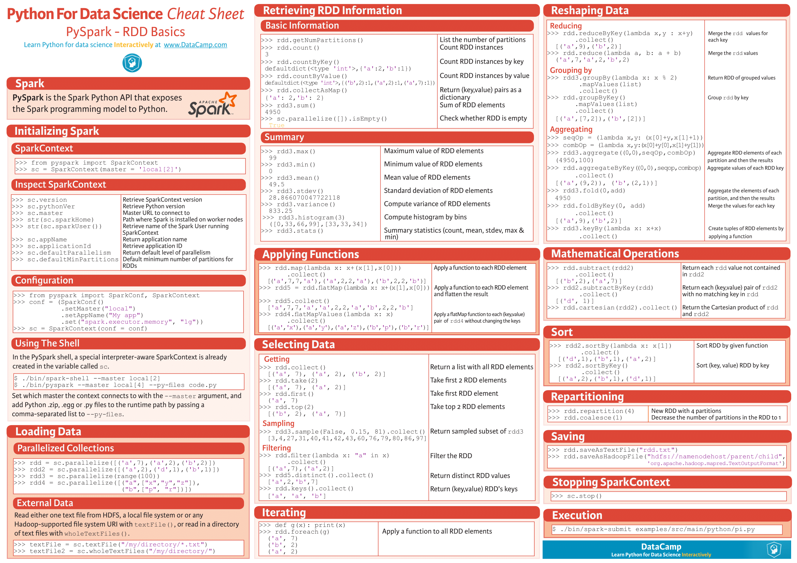
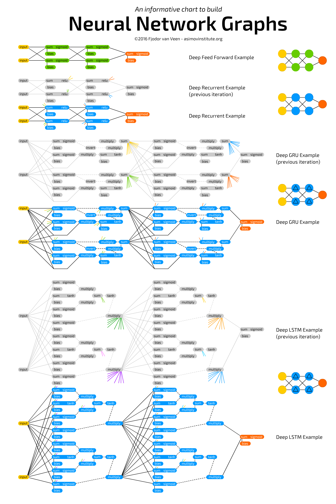

# Data Science Libraries Cheat Sheet

### **1. NumPy:**
   - 🧮 Fundamental package for numerical computing.
   - 🔢 Multidimensional arrays (ndarray).
   - ➕ Mathematical functions for array manipulation.
   - ⚙️ Linear algebra operations, Fourier transform, random number generation.

<!--  -->
### **2. pandas:**
   - 🐼 Data manipulation and analysis library.
   - 📊 DataFrame data structure for handling labeled data.
   - 🔍 Data alignment, indexing, filtering, and reshaping.
   - 🕒 Time-series functionality.

---

<a name="layers"/>

### **3. scikit-learn:**
   - 🛠️ Simple and efficient tools for data mining and data analysis.
   - 🤖 Comprehensive collection of supervised and unsupervised learning algorithms.
   - 📈 Model selection, evaluation, and validation.
   - 🧩 Feature extraction and preprocessing techniques.

---

### **4. Matplotlib:**
   - 📈 2D plotting library for creating static, interactive, and animated visualizations.
   - 📉 Line plots, scatter plots, bar plots, histograms, etc.
   - 🎨 Highly customizable plots.

---
### **5. Seaborn:**
   - 📊 Statistical data visualization library based on Matplotlib.
   - 📈 High-level interface for drawing attractive and informative statistical graphics.
   - 🔄 Support for complex visualizations like categorical plots, time series, and pair plots.

---

### **6. TensorFlow:**
   - 🧠 Open-source machine learning library for high-performance numerical computation.
   - 💪 Flexible architecture for deep learning models.
   - 🖥️ Scalability across multiple CPUs and GPUs.
   - 🧱 Integration with Keras for building neural networks.

---
### **7. PyTorch:**
   - 🔥 Deep learning framework with dynamic computational graphs.
   - 🤗 Easy-to-use API for building and training neural networks.
   - 💻 Support for GPU acceleration.
   - 🌐 Widely used in research and production environments.
<!--  -->
---
### **8. SciPy:**
   - 🔬 Library for scientific computing and technical computing.
   - 🧪 Integration with NumPy arrays for mathematical algorithms and functions.
   - 📈 Optimization, interpolation, integration, linear algebra, and more.

---
### **9. Statsmodels:**
   - 📊 Statistical modeling and hypothesis testing library.
   - 📈 Linear and non-linear regression models.
   - 🕰️ Time series analysis.
   - 🧪 Statistical tests and diagnostics.
<!--  -->
---
### **10. NLTK (Natural Language Toolkit):**
   - 📝 Library for natural language processing (NLP).
   - 🔠 Tokenization, stemming, tagging, parsing, and semantic reasoning.
   - 📚 Corpus readers and lexical resources.
<!--  -->
---
### **11. Keras:**
   - 🚀 High-level neural networks API, running on top of TensorFlow, Theano, or CNTK.
   - 🧠 Designed for fast experimentation with deep neural networks.
   - 🤖 User-friendly interface for building convolutional networks, recurrent networks, and more.
<!--  -->
---
### **12. Scrapy:**
   - 🕷️ Web crawling and web scraping framework.
   - 🌐 Extract structured data from websites.
   - ⏩ Asynchronous and fast.
<!--  -->
---
### **13. Beautiful Soup:**
   - 🥣 HTML and XML parsing library.
   - 🌳 Navigate and search parse trees.
   - 🔍 Extract useful information from web pages.
<!--  -->
---
### **14. SQLAlchemy:**
   - 🗃️ SQL toolkit and Object-Relational Mapping (ORM) library.
   - 📝 SQL expression language.
   - 💼 Database connection pooling and transaction management.

### **15. PySpark:**
   - 🚀 PySpark is the Python API for Apache Spark, a powerful open-source distributed computing system.
   - 🔥 It provides easy-to-use APIs for working with large-scale data processing and analytics.
   - 💻 PySpark enables parallel processing and fault-tolerant distributed data processing for big data applications.
   - 📊 It offers support for various data sources including Hadoop Distributed File System (HDFS), Apache Hive, Apache HBase, and more.
   - 🧠 PySpark's DataFrame API provides a familiar interface for data manipulation similar to pandas, making it easy for Python developers to work with large datasets.
   - 📈 It includes modules for machine learning (MLlib) and streaming (Spark Streaming), allowing for scalable machine learning and real-time data processing.
   - 🌐 PySpark can be integrated with other Python libraries and frameworks such as NumPy, pandas, and scikit-learn for advanced analytics and machine learning workflows.
   - ⚡️ Overall, PySpark is a versatile tool for big data processing and analytics, suitable for both research and production environments.

---

---
## Neural network

